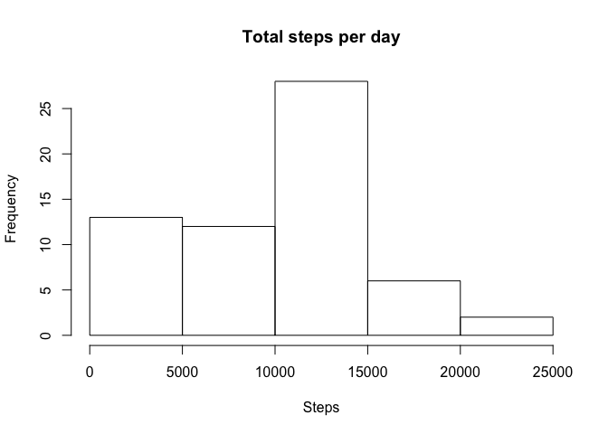

# Reproducible Research: Peer Assessment 1


## Loading and preprocessing the data


```r
data <- read.csv(unz("activity.zip", "activity.csv"))
```


## What is mean total number of steps taken per day?

Calculate the total number of steps per day and show the distribution of the resulting total.

```r
sums <- aggregate(steps ~ date, data, sum)
hist(sums$steps, xlab = "Steps", main = "Total steps per day")
```

 

The mean and the median of totals are:

```r
mean(sums$steps)
```

```
## [1] 10766.19
```

```r
median(sums$steps)
```

```
## [1] 10765
```

## What is the average daily activity pattern?

Calculate the distribution of steps over teh day by summing up corresponding time
intervals over all dates.

```r
daily <- aggregate(steps ~ interval, data, sum)
plot(steps ~ interval, daily, type = 'l', xaxt = 'n', main = "Daily activity pattern")
ticks <- pretty(daily$interval)
format.interval <- function (x) formatC(x, big.mark = ':', big.interval = 2, 
                                        width = 4, flag = 0)
interval2time <- format.interval(ticks)
axis(1, at = ticks, labels = interval2time)
```

 

What is the interval with the maximum steps?

```r
format.interval(daily[which.max(daily$steps), "interval"])
```

```
## [1] "08:35"
```
It seems to be about the time when most people hurry to work.
## Inputing missing values

Their are some values missing for steps. How many data sets are imcomplete?

```r
nrow(data[is.na(data$steps),])
```

```
## [1] 2304
```

Let's put the median for the corresponding interval in place of the missing values.
First we construct a lookup table with the median values. Than we make a copy of the original data and fill in the missing values.

```r
medians <- aggregate(steps ~ interval, data, median)
data.noNA <- data
data.noNA[is.na(data.noNA$steps),"steps"] <- medians[match(data.noNA[is.na(data.noNA$steps),"interval"], medians$interval), "steps"]
```

When we redo the calculations of the first step, we see that the dates with less steps are effected most.

```r
sums.noNA <- aggregate(steps ~ date, data.noNA, sum)
hist(sums.noNA$steps, xlab = "Steps", main = "Total steps per day")
```

 

```r
mean(sums.noNA$steps)
```

```
## [1] 9503.869
```

```r
median(sums.noNA$steps)
```

```
## [1] 10395
```


## Are there differences in activity patterns between weekdays and weekends?

To see the difference between weekdays and weekends we first introduce a new factor variable.

```r
data$day.kind <- as.factor(
  ifelse(weekdays(as.Date(data$date)) %in% c("Saturday", "Sunday"), 
         "Weekend", "Weekday"))
daily <- aggregate(steps ~ interval + day.kind, data, sum)
```

With that factor variable we can draw two plots, one for weekdays and one for weekends.  On weekends people are generally layier. Especially around the time the usually go to work.

```r
library(ggplot2)
ggplot(daily, aes(x = interval, y = steps)) +
  geom_line() + 
  facet_grid(day.kind ~ .) +
  scale_x_continuous(breaks = ticks, labels = interval2time) +
  ggtitle("Total steps differentiated by weekday / weekend")
```

 

